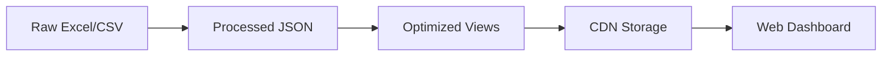

# MBON Marine Biodiversity Dashboard

Interactive web dashboard for acoustic biodiversity analysis in marine environments.

## Overview

This project creates optimized, view-based data pipelines for marine acoustic analysis, converting raw Excel/CSV data into performance-optimized JSON views for interactive web visualization.

## 🚀 Quick Start

### For New Developers

1. **Clone and setup**:
   ```bash
   git clone <repository>
   cd mbon-dash-2025
   uv sync                    # Install Python dependencies
   npm install                # Install Node.js dependencies
   uv pip install -e .        # Install mbon_analysis package
   ```

2. **Get data and start developing**:
   ```bash
   npm run sync-data          # Download latest raw data from CDN
   npm run process-data       # Convert Excel/CSV to processed JSON
   npm run generate-views     # Create optimized view files
   npm run dev               # Start development server
   ```

3. **Deploy changes**:
   ```bash
   npm run deploy:check       # See what would be deployed
   npm run deploy            # Deploy views to CDN
   ```

## 📊 Data Pipeline Architecture

### The Complete Flow



### 1. Raw Data → Processed JSON

**Source**: Excel files with species detections, environmental data, acoustic indices

**Command**: `npm run process-data`

**What it does**:
- Reads Excel files from `data/2018/` and `data/2021/`
- Normalizes timestamps and data formats
- Combines detection, environmental, and acoustic data
- Outputs to `data/cdn/processed/`:
  - `detections.json` - Species detection records
  - `environmental.json` - Temperature/depth measurements  
  - `acoustic_indices.json` - All acoustic index calculations
  - `stations.json` - Station metadata
  - `species.json` - Species definitions

### 2. Processed JSON → Optimized Views

**Command**: `npm run generate-views`

**What it does**:
- Takes processed JSON and creates visualization-specific data
- Applies aggregation, filtering, and size optimization
- Outputs to `data/cdn/views/`:
  - `station_overview.json` (~5KB) - Station locations and stats
  - `species_timeline.json` (~2KB) - Monthly aggregated detections
  - `acoustic_summary.json` (~20KB) - PCA analysis of indices
  - `raw_data_landscape.json` (~32KB) - Index availability matrix

**Performance Impact**: Reduces 218MB+ of raw data to <100KB of optimized views

### 3. Optimized Views → CDN Storage

**Command**: `npm run deploy`

**What it does**:
- Hash-based change detection (only uploads modified files)
- Atomic deployment with rollback capability
- Updates manifest for version tracking
- Validates deployment accessibility

**CDN Structure**:
```
https://waveformdata.work/
├── views/                    # Optimized view files
│   ├── station_overview.json
│   ├── species_timeline.json
│   ├── acoustic_summary.json
│   └── raw_data_landscape.json
└── processed/               # Raw processed data (legacy)
    ├── detections.json
    └── environmental.json
```

### 4. CDN Storage → Web Dashboard

**Frontend**: Next.js with TypeScript, Observable Plot

**Data Loading**: View-specific hooks
```typescript
const { data, loading } = useStationOverview();    // Loads 5KB
const { data, loading } = useAcousticSummary();    // Loads 20KB vs 166MB!
```

## 🛠 Key Commands Reference

### Data Management
```bash
# Sync raw data from CDN
npm run sync-data              # Smart sync (only changed files)
npm run sync-data:check        # See what needs updating
npm run sync-data:force        # Force download everything

# Process raw data to JSON
npm run process-data           # Excel/CSV → processed JSON
npm run validate-data          # Check data integrity
```

### View Generation
```bash
# Generate optimized views
npm run generate-views         # Create all view files
npm run deploy:check          # See what would be deployed
npm run deploy               # Deploy to CDN
```

### Development
```bash
npm run dev                  # Start development server
npm run dev:fresh           # Process data + start server
npm run test                # Run tests
npm run lint               # Check code quality
```

### Testing
```bash
# Python tests
uv run pytest tests/unit/ -v           # Unit tests
uv run pytest tests/integration/ -v    # Integration tests

# JavaScript tests
npm test                               # React component tests
```

## 📁 Project Structure

```
mbon-dash-2025/
├── data/
│   ├── cdn/
│   │   ├── raw-data/              # Source Excel/CSV files
│   │   ├── processed/             # Normalized JSON data
│   │   └── views/                 # Optimized view files
│   
├── mbon_analysis/                 # Python package
│   ├── core/                      # Data loading and processing
│   ├── views/                     # View generators
│   │   ├── station_views.py       
│   │   ├── species_views.py       
│   │   ├── acoustic_views.py      
│   │   └── chart_views.py         # NEW: Chart-specific views
│   └── deployment/                # CDN deployment tools
│
├── scripts/
│   ├── dashboard_prep/            # Core data processing
│   ├── view_generation/           # View generation scripts
│   └── deployment/                # CDN deployment scripts
│
├── src/                          # Next.js web application
│   ├── app/                      # Pages
│   ├── components/               # React components
│   ├── lib/hooks/                # Data loading hooks
│   └── types/                    # TypeScript definitions
│
└── tests/                        # Test suites
    ├── unit/                     # Unit tests
    └── integration/              # Integration tests
```

## 🎯 View System Benefits

### Performance Improvements
- **Station data**: 9KB → 7KB (modest)  
- **Species timeline**: ~2MB → 1.6KB (**1,000x faster**)
- **Acoustic indices**: 166MB → 19.6KB (**8,686x faster**)
- **Chart data**: Large files → 32KB (significant improvement)

### Developer Benefits
- **One-command deployment**: `npm run deploy`
- **Safe migration**: Old and new systems coexist
- **Test-driven development**: Comprehensive test coverage
- **Type safety**: Full TypeScript support

## 🔬 Research Focus

**Core Question**: Can acoustic indices predict marine soundscape biodiversity as an alternative to manual species detection?

**Analysis Approach**:
- PCA dimensionality reduction (61 indices → 5 components)
- Index categorization by research domain
- Temporal and spatial pattern analysis
- Species co-occurrence studies

## 🚦 Development Workflow

### Adding a New Chart View

1. **Write tests first** (TDD approach):
   ```bash
   # Create tests in tests/unit/test_chart_views.py
   uv run pytest tests/unit/test_chart_views.py -v
   ```

2. **Implement view generator**:
   ```python
   # Add to mbon_analysis/views/chart_views.py
   def generate_new_chart_view(processed_data_dir: Path) -> dict:
       # Implementation here
   ```

3. **Add to generation script**:
   ```python
   # Update scripts/view_generation/generate_chart_views.py
   ```

4. **Test and deploy**:
   ```bash
   npm run generate-views    # Generate locally
   npm run deploy:check     # Verify changes
   npm run deploy          # Deploy to CDN
   ```

### Modifying Existing Views

1. **Update generator function** in `mbon_analysis/views/`
2. **Run tests**: `uv run pytest tests/unit/ -v`
3. **Regenerate views**: `npm run generate-views`
4. **Deploy**: `npm run deploy`

## 🔧 Configuration

### Environment Variables
```bash
# .env.local
CDN_PROVIDER=cloudflare_r2
CDN_BASE_URL=https://waveformdata.work
NEXT_PUBLIC_DATA_URL=https://waveformdata.work

# CDN credentials (for deployment)
CLOUDFLARE_ACCOUNT_ID=your_account_id
CLOUDFLARE_R2_ACCESS_KEY=your_access_key
CLOUDFLARE_R2_SECRET_KEY=your_secret_key
CLOUDFLARE_R2_BUCKET_NAME=your_bucket_name
```

## 🆘 Troubleshooting

### Common Issues

**Data not loading**:
```bash
npm run sync-data:check        # Check if data is outdated
npm run sync-data             # Download latest data
```

**Views not updating**:
```bash
npm run generate-views        # Regenerate views
ls -la data/cdn/views/       # Check file timestamps
```

**Deployment failing**:
```bash
npm run deploy:check         # Check what would be deployed
# Check .env.local credentials
```

**Tests failing**:
```bash
uv run pytest tests/unit/ -v     # Run with verbose output
npm test                         # Check frontend tests
```

## 📈 Performance Monitoring

### Size Targets
- Station overview: < 10KB
- Species timeline: < 100KB  
- Acoustic summary: < 50KB
- Chart views: < 50KB each

### Monitoring Commands
```bash
# Check view file sizes
ls -lh data/cdn/views/

# Test deployment size
npm run deploy:check
```

## 🤝 Contributing

1. **Follow TDD**: Write tests before implementation
2. **Keep views optimized**: Target size limits
3. **Document changes**: Update this README
4. **Test thoroughly**: Both unit and integration tests

## 📚 Additional Resources

- **REFACTORING_PLAN.md**: Detailed migration progress
- **CLAUDE.md**: Project-specific development guidelines
- **tests/**: Comprehensive test examples
- **mbon_analysis/**: Python package documentation

---

*This documentation reflects the current view-based architecture. For legacy system information, see README_old.md*