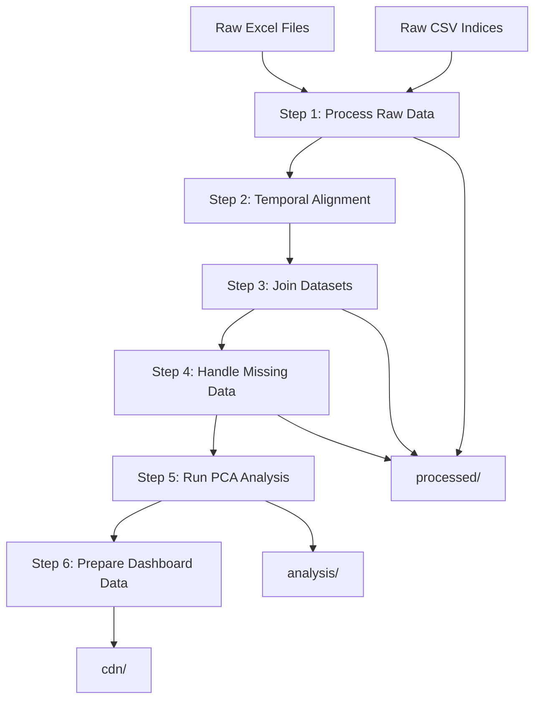

# Data Structure

Understanding how data is organized in the project, from raw files to analysis-ready datasets.

## Directory Organization

```
mbon-dash-2025/
├── data/                      # Raw data (version controlled)
├── processed/                 # Intermediate files (generated, not committed)  
├── analysis/                  # Analysis results (generated, not committed)
├── cdn/                      # Dashboard-ready data (generated, not committed)
└── scripts/                  # Processing and analysis code
```

!!! note "Version Control Strategy"
    Only raw data in `data/` is committed to git. All processed results are generated by the pipeline and excluded from version control to avoid large file storage issues.

## Raw Data (`data/`)

### Detection Data (Primary Dataset)
Manual species annotations from hydrophone recordings.

```
data/
├── 2018/
│   ├── Master_Manual_9M_2h_2018.xlsx
│   ├── Master_Manual_14M_2h_2018.xlsx
│   └── Master_Manual_37M_2h_2018.xlsx
└── 2021/
    ├── Master_Manual_9M_2h_2021.xlsx
    ├── Master_Manual_14M_2h_2021.xlsx
    └── Master_Manual_37M_2h_2021.xlsx
```

**Key characteristics:**
- Temporal resolution: 2-hour windows
- 3 stations: 9M, 14M, 37M  
- 2 years: 2018, 2021
- ~28 species columns with detection counts

### Environmental Data (Secondary Dataset)
Temperature and depth measurements for environmental context.

```
data/
├── 2018/
│   ├── Master_9M_Temp_2018.xlsx
│   ├── Master_9M_Depth_2018.xlsx
│   └── [similar for 14M, 37M]
└── 2021/
    └── [similar structure]
```

**Key characteristics:**
- Higher temporal resolution than detection data
- Continuous measurements
- Used for environmental correction and context

### Acoustic Indices (NEW - Primary Analysis Focus)
Comprehensive acoustic indices from collaborator analysis.

```
data/indices/raw/
├── Acoustic_Indices_9M_FullBW_v1.csv      # ✅ Available
├── Acoustic_Indices_14M_FullBW_v1.csv     # 🔄 Expected
├── Acoustic_Indices_37M_FullBW_v1.csv     # 🔄 Expected
└── [additional bandwidth variants]         # 🔄 Expected
```

**Key characteristics:**
- Temporal resolution: Hourly (aggregated to 2-hour for analysis)
- 56 different acoustic indices per record
- Multiple index categories (temporal, frequency, complexity, diversity)

### Deployment Metadata
Information about hydrophone deployments and station characteristics.

```
data/
└── 1_Montie Lab_metadata_deployments_2017 to 2022.xlsx
```

**Contains:**
- Deployment dates and durations
- Station coordinates and characteristics  
- Equipment specifications
- Data collection parameters

## Processed Data (`processed/`)

Intermediate files generated during the processing pipeline.

### Structure
```
processed/
├── indices/                   # Cleaned acoustic indices
│   ├── indices_9M_2021.json
│   ├── indices_14M_2021.json  
│   └── indices_combined.json
├── detections/               # Processed detection data
├── environmental/            # Processed environmental data
└── combined/                 # Temporally aligned datasets
    ├── full_dataset.json    # All data types joined
    └── analysis_ready.json  # Filtered for analysis
```

## Analysis Results (`analysis/`)

Results from statistical analysis and modeling.

### Structure
```
analysis/
├── pca/                      # Principal component analysis
│   ├── pca_loadings.json    # Component loadings for each index
│   ├── pca_scores.json      # Component scores for each observation  
│   └── explained_variance.json # Variance explained by each component
├── correlations/             # Index-species correlations
├── summaries/               # Statistical summaries
└── model_results/           # Predictive model outputs
```

## Data Flow



## File Formats

### Raw Data Formats
- **Excel files (.xlsx)**: Detection and environmental data
- **CSV files (.csv)**: Acoustic indices data
- **Mixed formats**: Handle various naming conventions automatically

### Processed Data Formats  
- **JSON**: Structured data for analysis and dashboard
- **Optimized for analysis**: Consistent column names, data types
- **Quality flags**: Missing data indicators, interpolation flags

## Data Quality Indicators

### Completeness Flags
- `data_quality`: Overall quality score (0-1)
- `missing_data_percent`: Percentage of missing values
- `interpolated_windows`: Count of interpolated time periods
- `deployment_active`: Whether station was actively deployed

### Processing Metadata
- `processing_date`: When data was last processed
- `pipeline_version`: Version of processing pipeline used
- `source_files`: List of source files contributing to record
- `quality_checks`: Results of validation tests

## Temporal Alignment

### Challenge
- **Acoustic indices**: Hourly measurements  
- **Detection data**: 2-hour windows
- **Environmental data**: Variable intervals

### Solution
Aggregate acoustic indices to 2-hour windows using configurable methods:

```python
AGGREGATION_METHODS = {
    'mean': np.mean,      # Default for most indices
    'max': np.max,        # For peak detection indices
    'sum': np.sum,        # For count-based indices  
    'median': np.median   # For robust central tendency
}
```

## Missing Data Patterns

### Expected Gaps
- **Deployment gaps**: Periods when stations not operational
- **Equipment failures**: Technical issues causing data loss
- **Processing artifacts**: Quality control filtering

### Handling Strategy
- **Document all gaps**: Clear metadata about missing periods
- **Quality flags**: Indicate interpolated vs measured values
- **Analysis impact**: Report how missing data affects results

This structure provides flexibility to handle current data while accommodating future datasets from collaborators.