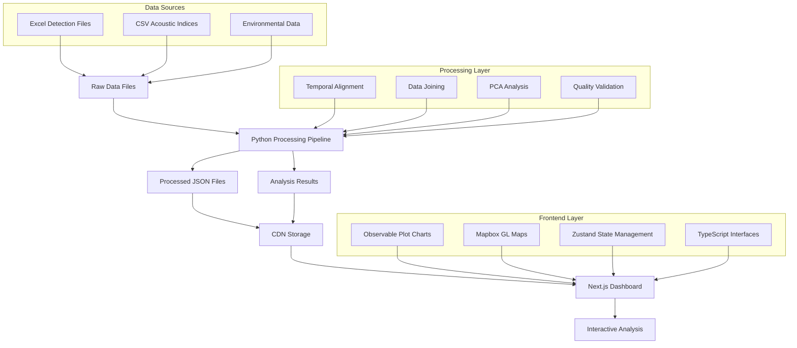

# Architecture

Technical architecture overview for developers working on the MBON dashboard project.

## System Overview



## Architecture Principles

### Hybrid Python/JavaScript Approach
- **Python**: Heavy data processing, statistical analysis, scientific computing
- **JavaScript**: Interactive visualization, user interface, web deployment
- **Rationale**: Use each language's strengths rather than forcing everything into one ecosystem

### Data-First Design
- Processing pipeline generates all data before dashboard needs it
- Dashboard consumes pre-processed JSON from CDN
- No real-time data processing in the browser
- Clear separation between analysis and presentation

### Reproducible Research
- All processing steps are scripted and version controlled
- Pipeline can be re-run completely to regenerate all results
- Clear data provenance from raw files to dashboard displays

## Data Processing Architecture

### Pipeline Structure
```
scripts/
├── pipeline/                 # New modular pipeline
│   ├── run_full_pipeline.py # Main pipeline orchestrator
│   └── steps/               # Individual processing steps
│       ├── 1_process_raw_data.py
│       ├── 2_align_temporal_windows.py
│       ├── 3_join_datasets.py
│       ├── 4_handle_missing_data.py
│       ├── 5_run_pca_analysis.py
│       └── 6_prepare_dashboard_data.py
├── analysis/                # Statistical analysis scripts
│   ├── pca_analysis.py
│   └── correlation_analysis.py
└── legacy/                  # Original processing scripts
    ├── process_data.py
    └── validate_data.py
```

### Processing Flow
1. **Raw Data Ingestion**: Read Excel/CSV files with flexible naming
2. **Quality Validation**: Check data integrity and completeness  
3. **Temporal Alignment**: Aggregate hourly indices to 2-hour detection windows
4. **Data Joining**: Combine acoustic indices with species and environmental data
5. **Missing Data Handling**: Interpolation and quality flagging
6. **Statistical Analysis**: PCA, correlation analysis, model fitting
7. **Dashboard Preparation**: Export optimized JSON for web consumption

### Data Storage Strategy
```
data/                     # Raw data (version controlled)
├── indices/raw/         # Acoustic indices CSV files
├── 2018/, 2021/        # Detection and environmental Excel files
└── metadata.xlsx       # Deployment information

processed/               # Intermediate files (generated, git-ignored)
├── indices/            # Processed acoustic data
├── detections/         # Processed species data  
├── environmental/      # Processed temp/depth data
└── combined/          # Joined datasets

analysis/               # Analysis results (generated, git-ignored)  
├── pca/               # PCA loadings, scores, variance
├── correlations/      # Correlation matrices
└── summaries/         # Statistical summaries

cdn/                   # Dashboard data (generated, git-ignored)
├── detections.json   # Species detection data
├── indices.json      # Acoustic indices data
├── analysis.json     # PCA and correlation results
└── metadata.json     # Data summary and statistics
```

## Frontend Architecture

### Technology Stack
- **Framework**: Next.js 14 with App Router
- **Language**: TypeScript for type safety
- **Styling**: Tailwind CSS for utility-first styling
- **Visualization**: Observable Plot (primary), Mapbox GL JS for maps
- **State Management**: Zustand for application state
- **Deployment**: Vercel for static site deployment

### Component Architecture
```
src/
├── app/                    # Next.js app router
│   ├── layout.tsx         # Root layout
│   ├── page.tsx           # Dashboard overview
│   └── [analysis-pages]/  # Individual analysis views
├── components/
│   ├── charts/            # Observable Plot chart components
│   ├── maps/              # Mapbox map components
│   ├── filters/           # Data filtering controls
│   ├── ui/                # Reusable UI components
│   └── export/            # Data export functionality
├── lib/
│   ├── hooks/             # Custom React hooks
│   │   └── useData.ts     # Data loading hooks
│   └── utils/             # Utility functions
├── store/                 # Zustand stores
│   └── useAppStore.ts     # Application state management
└── types/
    └── data.ts            # TypeScript interfaces
```

### Data Loading Strategy
Centralized data loading through custom hooks:

```typescript
// Main data loading hook
export function useCoreData() {
  const { data: detections } = useDetections()
  const { data: indices } = useIndices() 
  const { data: analysis } = useAnalysis()
  const { data: metadata } = useMetadata()
  
  return {
    detections,
    indices, 
    analysis,
    metadata,
    isLoading: !detections || !indices || !analysis || !metadata
  }
}
```

### State Management
Zustand store for application state:

```typescript
interface AppStore {
  // Filter state
  filters: {
    selectedStations: string[]
    selectedSpecies: string[]
    dateRange: [Date, Date]
    selectedIndices: string[]
  }
  
  // UI state  
  ui: {
    sidebarOpen: boolean
    activeView: string
    exportFormat: 'csv' | 'json' | 'png'
  }
  
  // Data cache
  cache: {
    lastUpdated: Date
    dataVersion: string
  }
  
  // Actions
  setSelectedStations: (stations: string[]) => void
  setDateRange: (range: [Date, Date]) => void
  // ... other actions
}
```

## Development Workflow

### Local Development
```bash
# 1. Process data (Python)
npm run build-data

# 2. Start dashboard (JavaScript)  
npm run dev

# 3. Validate results
npm run validate-data
npm run data-stats
```

### Production Deployment
```bash
# 1. Process data locally
npm run build-data

# 2. Upload data to CDN (manual)
# Copy files from cdn/ to Cloudflare R2

# 3. Deploy dashboard to Vercel
git push origin main
# Auto-deploys via GitHub integration
```

### Testing Strategy
- **Data validation**: Python scripts check data integrity
- **Type checking**: TypeScript ensures frontend type safety
- **Integration testing**: Validate full pipeline from raw data to dashboard
- **Visual testing**: Screenshot testing for chart rendering

## Extensibility

### Adding New Data Sources
1. Create new processing step in `scripts/pipeline/steps/`
2. Update data interfaces in `src/types/data.ts`
3. Add data loading hook in `src/lib/hooks/`
4. Create visualization components as needed

### Adding New Analysis Methods
1. Create analysis script in `scripts/analysis/`
2. Update pipeline to include new analysis
3. Export results to JSON for dashboard consumption
4. Add visualization components for new results

### Adding New Dashboard Views
1. Create page in `src/app/new-view/`
2. Add navigation links in layout
3. Create necessary chart components
4. Update state management if needed

## Performance Considerations

### Data Processing
- **Lazy loading**: Process only requested data subsets when possible
- **Caching**: Save intermediate results to avoid recomputation
- **Parallel processing**: Use multiprocessing for independent operations
- **Memory management**: Process large datasets in chunks

### Frontend Performance
- **Static generation**: Pre-render pages at build time where possible
- **Code splitting**: Load only necessary JavaScript for each page
- **Data streaming**: Load large datasets progressively
- **Chart optimization**: Use Observable Plot's efficient rendering

### Deployment Optimization
- **CDN usage**: Serve all data files from CDN for fast global access
- **Compression**: Gzip JSON files to reduce transfer size
- **Edge caching**: Cache static assets at edge locations
- **Bundle optimization**: Tree-shake unused dependencies

## Security Considerations

### Data Privacy
- All data is aggregated marine biodiversity observations (no personal data)
- Raw data files may contain deployment location information
- Dashboard displays only processed, anonymized results

### Application Security
- CSP headers prevent XSS attacks
- No user-generated content or file uploads
- Static site deployment reduces attack surface
- Environment variables protect API keys (Mapbox, CDN access)

### Development Security
- Dependencies regularly updated and audited
- TypeScript prevents common runtime errors
- Linting rules enforce secure coding practices
- Secrets excluded from version control

This architecture balances scientific computing needs with web development best practices, providing a scalable foundation for marine biodiversity research.