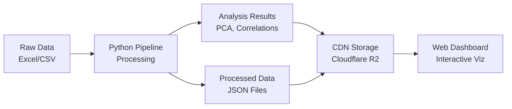

# MBON Marine Biodiversity Dashboard

Interactive web dashboard for exploring marine acoustic monitoring data from the OSA MBON project (2018-2021).

**Research Focus**: Can acoustic indices predict marine biodiversity patterns as an alternative to labor-intensive manual species detection?

## Project Overview

This project integrates comprehensive acoustic indices data with species detection and environmental measurements to identify cost-effective alternatives to manual species annotation. The analysis focuses on 3 monitoring stations in May River, South Carolina, with 56 acoustic indices analyzed against manual species detection data.

### Current Dataset

- **26,280** detection records (manual species annotations)
- **237,334** environmental records (temperature, depth)  
- **3** monitoring stations (9M, 14M, 37M in May River, SC)
- **56** acoustic indices (from collaborator)
- **2** years of data (2018, 2021)
- **28** species tracked

### Research Goals

1. **Index Reduction**: Can we reduce 56 acoustic indices to 3-5 "super indices"?
2. **Biodiversity Prediction**: Which indices best predict species detection patterns?  
3. **Cost-Effectiveness**: Can acoustic indices replace expensive manual annotation?
4. **Environmental Context**: How do temperature/depth affect acoustic patterns?

## Quick Start

!!! tip "Two Ways to Work"
    This project supports both **Python-first** workflows (familiar to scientists) and **unified commands** (convenient for teams). Use whichever approach feels comfortable.

### Installation

```bash
# Clone the repository
git clone [repository-url]
cd mbon-dash-2025

# Install dependencies
uv sync          # Python dependencies for data processing
npm install      # Node.js dependencies for web dashboard
```

### Basic Workflow

=== "Python Approach"

    ```bash
    # Process data
    uv run scripts/pipeline/run_full_pipeline.py
    
    # Run analysis
    uv run scripts/analysis/pca_analysis.py
    
    # Check data quality
    uv run scripts/legacy/validate_data.py
    ```

=== "Unified Commands"

    ```bash
    # Process data
    npm run build-data
    
    # Run analysis
    npm run build-analysis
    
    # Check data quality  
    npm run validate-data
    ```

### Start Dashboard

```bash
# Configure environment (first time only)
cp .env.example .env.local
# Edit .env.local with your settings

# Start dashboard
npm run dev      # Opens at http://localhost:3000
```

## Architecture Overview



### Data Flow

1. **Raw Data**: Excel files (detections, environmental) + CSV files (acoustic indices)
2. **Python Processing**: Clean, align temporal windows, join datasets
3. **Analysis**: PCA, correlation analysis, biodiversity modeling
4. **Web Dashboard**: Interactive visualization of results

### Key Technologies

- **Data Analysis**: Python (pandas, numpy, scikit-learn)
- **Web Dashboard**: Next.js, TypeScript, Observable Plot
- **Deployment**: Vercel + Cloudflare R2 CDN

## Navigation Guide

### 👩‍🔬 **For Scientists**
- **[Getting Started](for-scientists/getting-started.md)**: Installation and first analysis
- **[Data Analysis Workflow](for-scientists/data-analysis.md)**: Step-by-step analysis guide
- **[Research Questions](for-scientists/research-questions.md)**: Scientific objectives and methods
- **[Acoustic Indices](for-scientists/acoustic-indices.md)**: Understanding the 56 indices

### 📊 **Data & Analysis**
- **[Data Structure](data/structure.md)**: How data is organized
- **[Processing Pipeline](data/processing-pipeline.md)**: Step-by-step data processing
- **[PCA Workflow](analysis/pca-workflow.md)**: Principal component analysis
- **[Correlation Analysis](analysis/correlation-analysis.md)**: Index-species relationships

### 👨‍💻 **For Developers**
- **[Architecture](for-developers/architecture.md)**: Technical overview
- **[Dashboard Development](for-developers/dashboard.md)**: Frontend development guide
- **[Deployment](for-developers/deployment.md)**: Hosting and CDN setup

### 📚 **Reference**
- **[Command Reference](reference/commands.md)**: Complete command list
- **[Troubleshooting](reference/troubleshooting.md)**: Common issues and solutions

## Project Status

This project is actively under development with a focus on acoustic indices integration and PCA analysis. The documentation will evolve as analysis methods are refined and new discoveries are made.

!!! note "Living Documentation"
    This documentation grows with the project. As we discover effective analysis approaches and refine our methods, the guides will be updated to reflect best practices.

## Getting Help

- **Data Issues**: Check [validation guide](data/validation.md) or run `npm run validate-data`
- **Analysis Questions**: See [research questions](for-scientists/research-questions.md) and [troubleshooting](reference/troubleshooting.md)
- **Technical Issues**: Check [architecture guide](for-developers/architecture.md)

---

*This project bridges marine biology and data science to make acoustic monitoring more accessible and cost-effective for biodiversity assessment.*